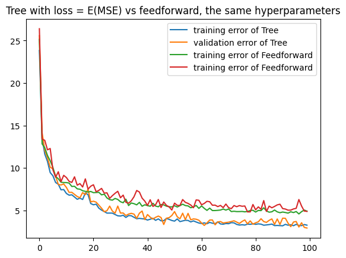
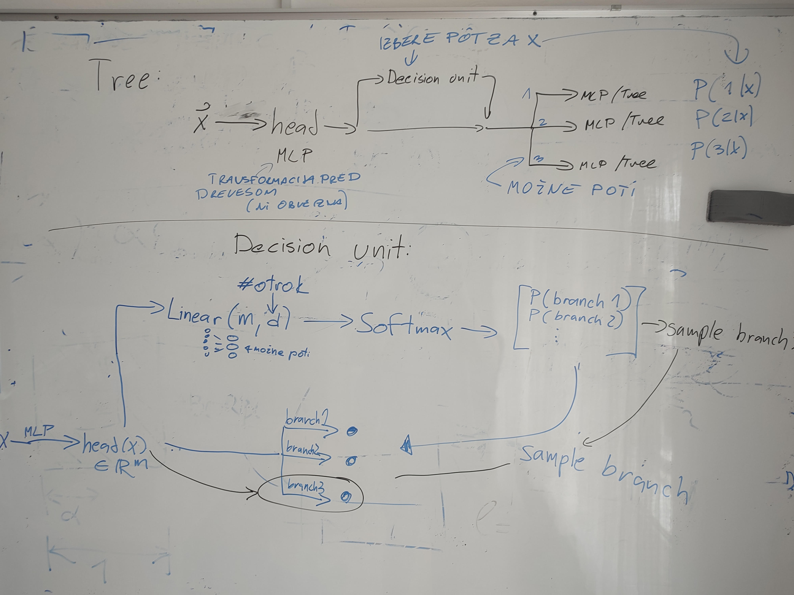

# tree-nn
Tree Neural Networks with decision units

# Ideja 

izmenjaje uporabljamo Tree layer in nek drug NN layer (recimo fully connected)..

Eno drevo ima več otrok = možnih modelov, skozi katere se pošlje input. Decision unit izbere eno pot za input s tem, da za vsako pot vrne verjetnost P(pot|input).

Vsaka pot je lahko svoj model. V demotu zgoraj imamo dve poti, obe sta dve mali mreži. V praksi bi bili tudi otroci dreves drevesa.
 
Head je (neobvezen) model, ki spremeni input, preden gre ta skozi drevo. To je samo zato, da lahko za izbiro poti uporabimo bolj komplicirano funckijo. V demo primeru je head ena zelo majhna mreža Linear(2,2).

Feedforward vs Tree
Učenje  bi v teoriji moralo biti enako hitro, saj moramo v obeh primerih čez vse parametre. V praksi se mi Feedforward uči hitreje. Pomojem bi se Tree dalo bolj spretno implementirat (ampak ni blazno počasen).
Napoved vrednosti za en input v drevesu dela hitreje, saj ne rabim obiskati vseh parametrov. V demo primeru moram za izračun enega modela samo skozi dobro polovico parametrov. Če bomo imeli drevo globine d (torej bodo otroci tudi drevesa...), bomo morali narediti eksponentno (v d) manj korakov.

Lep pozdrav,
## Training
- lahko izmenjaje treniramo `DecisionUnit` in `NN`
- oboje skupaj
- rabmo nekej nedeterminističnosti in samplinga 
### Loss
- $\mathcal L(\text{path}(x)) = \text{ERROR}(M(x)) + |\text{zeros in hidden layers}(\text{path}(x))|$
- namesto #ničel lahko gledamo tudi kaj drugega (želimo recimo lahko, da dobimo iskalno drevo - če veš, da si pravokoten na $z$, mogoče ni smiselno, da je $<z, y>$ velik za $y$, ki se pojavi naprej v modelu...)
- mogoče hočmo preprečit, da bi na več različnih koncih testiral iste stvari. Zato bi lah gledal, da v različnih poteh ni istih vprašanj... Ampak ta ideja je mogoče premočna za drevesno strukturo. Če bi neki bl zakompliciral, bi lah nardil en model, ki se efekitvno "zapolne neko dejstvo" o inputu, in ga ne rab večrkat računat... Ampak sj to kao vsi modeli delajo.

- **Kako prepoznati parametre, ki "ne vplivajo" na rezultat:** Težko. Lahko prepoznaš, ali sprememba parametra vpliva na rezultat (=odvod), ampak nočno čist tega. Če pa je odvod po temu parametru mali za večino inputov, pol pa je slabo. Tok da lah bi gledal neko "average velikost odvoda", pa hotu, da ni nič...? Ker če je odvod $\frac{dM(x)}{dp} = 0$ za zelo veliko $x \in X$, je mogoče tvoja funkcija v $p$ konstantna povsod....  Tega se lotimo z  REMSG in EMSG